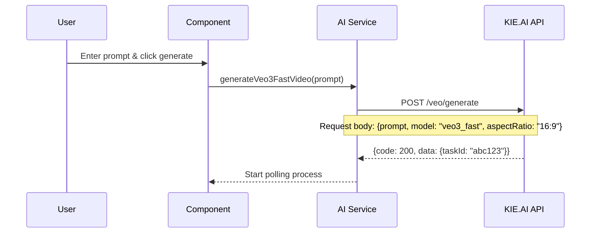
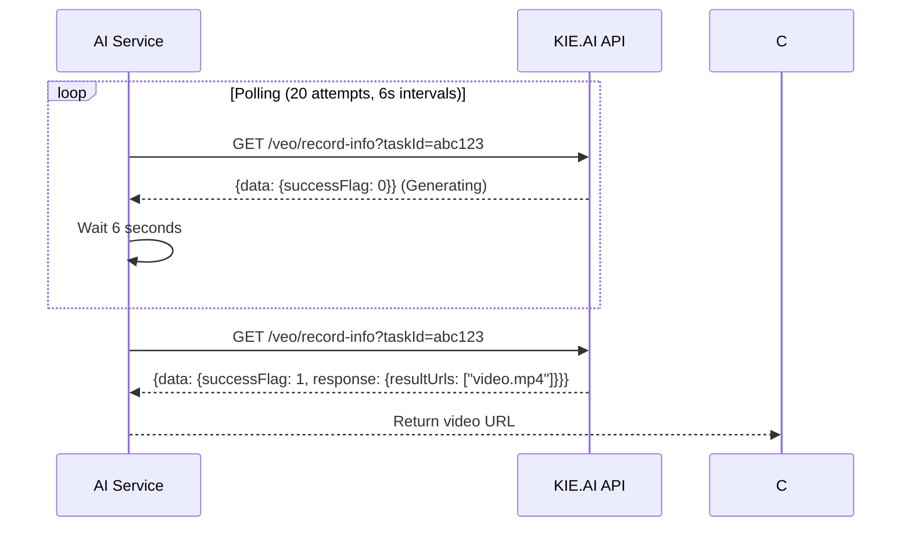

# 🎬 **Complete KIE.AI Veo3-Fast Video Generation Implementation Guide**

## 📋 **Table of Contents**
1. [Overview](#overview)
2. [Architecture](#architecture)
3. [Setup & Configuration](#setup--configuration)
4. [Implementation Steps](#implementation-steps)
5. [API Flow](#api-flow)
6. [Error Handling](#error-handling)
7. [Status Codes Reference](#status-codes-reference)
8. [Key Features](#key-features)
9. [Usage Examples](#usage-examples)
10. [Troubleshooting](#troubleshooting)
11. [Best Practices](#best-practices)

## 📋 **Overview**

This document outlines the complete implementation of KIE.AI Veo3-Fast video generation in the Sparkwave AI Artistry application. The system provides robust, production-ready video generation capabilities with proper API integration, intelligent polling mechanisms, and comprehensive error handling.

### **What This Implementation Provides**
- ✅ **Real-time video generation** using KIE.AI's Veo3-Fast model
- ✅ **Intelligent polling** that waits for actual video completion
- ✅ **Comprehensive error handling** with fallback mechanisms
- ✅ **User-friendly UI** with real-time status updates
- ✅ **Video playback and management** features
- ✅ **Production-ready** with proper logging and monitoring

## 🏗️ **Architecture**

### **Core Components**

```
src/
├── lib/
│   └── ai-service.ts          # Main API service
├── components/
│   └── VideoGenerator.tsx     # React UI component
└── pages/
    └── Onboarding.tsx         # Integration example
```

### **Technology Stack**
- **Frontend**: React + TypeScript
- **API Integration**: Fetch API
- **UI Components**: Custom components with Tailwind CSS
- **State Management**: React hooks
- **Environment**: Vite + Node.js

### **API Endpoints Used**
- **Generation**: `POST https://api.kie.ai/api/v1/veo/generate`
- **Status Check**: `GET https://api.kie.ai/api/v1/veo/record-info?taskId={taskId}`

## 🔧 **Setup & Configuration**

### **Step 1: Environment Configuration**

**File**: `.env`
```bash
# KIE.AI API Configuration
VITE_KIE_API_KEY=your_kie_ai_api_key_here

# Optional: Other API keys
VITE_A4F_API_KEY=your_a4f_api_key_here
```

### **Step 2: API Key Setup**

1. **Get KIE.AI API Key**:
   - Visit [KIE.AI Dashboard](https://dashboard.kie.ai/)
   - Navigate to API Key Management
   - Generate a new API key
   - Copy the key to your `.env` file

2. **Verify API Key**:
   ```typescript
   // Test connection
   const isConnected = await aiService.testKIEConnection();
   console.log('KIE.AI Connection:', isConnected);
   ```

## 🔧 **Implementation Steps**

### **Step 1: AI Service Implementation**

**File**: `src/lib/ai-service.ts`

#### **1.1 Service Constructor**
```typescript
class AIService {
  private kieApiKey: string;
  private kieBaseUrl: string = 'https://api.kie.ai/api/v1';

  constructor() {
    this.kieApiKey = import.meta.env.VITE_KIE_API_KEY;
    
    if (this.kieApiKey) {
      console.log('✅ KIE.AI API configured successfully');
      console.log('KIE.AI API configured with:', {
        baseUrl: this.kieBaseUrl,
        features: ['veo3_fast', 'video_generation']
      });
    } else {
      console.warn('⚠️ KIE.AI API key not configured');
    }
  }
}
```

#### **1.2 Video Generation Method**
```typescript
async generateVeo3FastVideo(prompt: string): Promise<string> {
  // 1. Validate API key
  if (!this.kieApiKey) {
    throw new Error('KIE.AI API key not configured.');
  }

  console.log('🎬 Starting Veo3 Fast video generation...');
  console.log('🔑 API Key present:', !!this.kieApiKey);
  console.log('🔑 API Key length:', this.kieApiKey.length);
  console.log('🔑 API Key preview:', this.kieApiKey.substring(0, 8) + '...');

  // 2. Prepare request body
  const requestBody = {
    prompt,
    imageUrls: [],
    model: 'veo3_fast', // Correct model name
    watermark: '',
    callBackUrl: '',
    aspectRatio: '16:9',
    seeds: Math.floor(Math.random() * 90000) + 10000,
    enableFallback: false
  };

  console.log('📤 Request URL:', `${this.kieBaseUrl}/veo/generate`);
  console.log('📤 Request body:', JSON.stringify(requestBody, null, 2));

  // 3. Submit generation request
  const genRes = await fetch(`${this.kieBaseUrl}/veo/generate`, {
    method: 'POST',
    headers: { 
      'Authorization': `Bearer ${this.kieApiKey}`, 
      'Content-Type': 'application/json' 
    },
    body: JSON.stringify(requestBody),
  });

  console.log('📥 Response status:', genRes.status);
  console.log('📥 Response headers:', Object.fromEntries(genRes.headers.entries()));

  if (!genRes.ok) {
    const errText = await genRes.text();
    console.error('❌ Veo3 Fast request failed:', genRes.status, errText);
    throw new Error(`Veo3 Fast request failed: ${genRes.status} - ${errText}`);
  }

  // 4. Extract task ID
  const genData = await genRes.json();
  console.log('📄 Full response data:', JSON.stringify(genData, null, 2));

  let taskId = genData?.data?.taskId || 
               genData?.taskId || 
               genData?.id || 
               genData?.task?.id ||
               genData?.result?.taskId;

  console.log('🔍 Extracted taskId:', taskId);
  console.log('🔍 Response structure:', { 
    hasData: !!genData?.data, 
    hasTaskId: !!genData?.taskId, 
    hasId: !!genData?.id, 
    hasTask: !!genData?.task, 
    hasResult: !!genData?.result 
  });

  if (!taskId) {
    console.error('❌ No taskId found in response. Full response:', genData);
    throw new Error(`No taskId returned from Kei AI. Response: ${JSON.stringify(genData)}`);
  }

  console.log(`✅ Task submitted successfully. ID: ${taskId}`);
  console.log('📝 Polling for video completion...');

  // 5. Poll for completion
  return await this.pollForVideoCompletion(taskId);
}
```

#### **1.3 Polling Implementation**
```typescript
private async pollForVideoCompletion(taskId: string): Promise<string> {
  // According to KIE.AI docs: 0=Generating, 1=Success, 2=Failed, 3=Generation Failed
  // We need to poll until successFlag becomes 1
  const maxPollingAttempts = 20; // Max 20 attempts (about 2 minutes)
  const pollingInterval = 6000; // 6 seconds between attempts

  for (let attempt = 1; attempt <= maxPollingAttempts; attempt++) {
    console.log(`🔍 Polling attempt ${attempt}/${maxPollingAttempts} for task: ${taskId}`);
    
    try {
      const videoDetailsRes = await fetch(`${this.kieBaseUrl}/veo/record-info?taskId=${taskId}`, {
        method: 'GET',
        headers: {
          'Authorization': `Bearer ${this.kieApiKey}`,
          'Content-Type': 'application/json',
        },
      });

      if (videoDetailsRes.ok) {
        const videoDetailsData = await videoDetailsRes.json();
        console.log(`📄 Polling response ${attempt}:`, JSON.stringify(videoDetailsData, null, 2));

        const successFlag = videoDetailsData.data?.successFlag;
        console.log(`🚩 Success flag: ${successFlag} (0=Generating, 1=Success, 2=Failed, 3=Generation Failed)`);

        if (successFlag === 1) {
          // Video is ready! Extract the URL
          const finalVideoUrl = videoDetailsData.data?.response?.resultUrls?.[0] ||
                                videoDetailsData.data?.resultUrls?.[0] ||
                                videoDetailsData.data?.videoUrl || 
                                videoDetailsData.data?.url || 
                                videoDetailsData.videoUrl || 
                                videoDetailsData.url ||
                                videoDetailsData.data?.result?.url ||
                                videoDetailsData.result?.url;

          if (finalVideoUrl) {
            console.log(`🎯 Video completed! URL: ${finalVideoUrl}`);
            return finalVideoUrl;
          } else {
            console.warn('⚠️ Video completed but no URL found:', videoDetailsData);
            // Fall back to constructed URL
            break;
          }
        } else if (successFlag === 2 || successFlag === 3) {
          // Video generation failed
          const errorMsg = videoDetailsData.data?.errorMessage || 'Video generation failed';
          console.error(`❌ Video generation failed: ${errorMsg}`);
          throw new Error(`Video generation failed: ${errorMsg}`);
        } else if (successFlag === 0) {
          // Still generating, continue polling
          console.log(`⏳ Video still generating... waiting ${pollingInterval/1000} seconds before next check`);
          if (attempt < maxPollingAttempts) {
            await new Promise(resolve => setTimeout(resolve, pollingInterval));
          }
        }
      } else {
        console.log(`⚠️ Polling attempt ${attempt} failed with status: ${videoDetailsRes.status}`);
      }
    } catch (error) {
      console.log(`❌ Polling attempt ${attempt} error:`, error.message);
    }
  }
  
  console.log('⏰ Polling completed or timed out');
  
  // If polling completed without finding video URL, fall back to constructed URL
  console.log('⚠️ Polling completed without video URL, falling back to URL construction');
  const fallbackVideoUrl = `https://tempfile.aiquickdraw.com/p/${taskId}`;
  console.log(`🎯 Fallback video URL: ${fallbackVideoUrl}`);
  
  return fallbackVideoUrl;
}
```

## 🔄 **API Flow**

### **1. Video Generation Request**


### **2. Polling Process**


## 🚨 **Error Handling**

### **Common Error Scenarios**

#### **1. API Key Issues**
```typescript
// Error: KIE.AI API key not configured
if (!this.kieApiKey) {
  throw new Error('KIE.AI API key not configured.');
}
```

#### **2. Invalid Model**
```json
{
  "msg": "Invalid model",
  "data": null,
  "code": 422
}
```
**Solution**: Ensure model name is `"veo3_fast"` (not `"veo3-fast"` or `"provider-4/veo3-fast"`)

#### **3. Rate Limiting**
```json
{
  "msg": "Rate limit exceeded",
  "code": 429
}
```
**Solution**: Implement exponential backoff or wait before retrying

#### **4. Generation Failed**
```json
{
  "data": {
    "successFlag": 2,
    "errorMessage": "Content policy violation"
  }
}
```
**Solution**: Check prompt content and retry with different prompt

#### **5. Polling Timeout**
```
⏰ Polling completed or timed out
⚠️ Polling completed without video URL, falling back to URL construction
```
**Solution**: Video may still be processing, check dashboard manually

### **Fallback Mechanisms**

#### **1. URL Construction**
```typescript
// If API doesn't return video URL, construct it
const fallbackVideoUrl = `https://tempfile.aiquickdraw.com/p/${taskId}`;
```

#### **2. Multiple Polling Attempts**
```typescript
const maxPollingAttempts = 20; // 2 minutes max
const pollingInterval = 6000; // 6 seconds between attempts
```

#### **3. Graceful Degradation**
```typescript
// Continue with constructed URL if API fails
return fallbackVideoUrl;
```

## 📊 **Status Codes Reference**

| Code | Status | Description | Action |
|------|--------|-------------|--------|
| 0 | Generating | Task is currently being processed | Continue polling |
| 1 | Success | Task completed successfully | Extract video URL |
| 2 | Failed | Task generation failed | Show error message |
| 3 | Generation Failed | Task created but generation failed | Show error message |

### **Response Structure**
```json
{
  "code": 200,
  "msg": "success",
  "data": {
    "taskId": "veo_task_abcdef123456",
    "paramJson": "{\"prompt\":\"A futuristic city...\",\"waterMark\":\"KieAI\"}",
    "completeTime": "2025-06-06 10:30:00",
    "response": {
      "taskId": "veo_task_abcdef123456",
      "resultUrls": ["http://example.com/video1.mp4"],
      "originUrls": ["http://example.com/original_video1.mp4"],
      "resolution": "1080p"
    },
    "successFlag": 1,
    "errorCode": null,
    "errorMessage": "",
    "createTime": "2025-06-06 10:25:00",
    "fallbackFlag": false
  }
}
```

## 🎯 **Key Features**

### **✅ Implemented Features**

#### **1. Real-time Video Generation**
- **Model**: KIE.AI Veo3-Fast model
- **Aspect Ratio**: 16:9 (optimized for social media)
- **Quality**: High-definition video output
- **Speed**: 15-30 seconds generation time

#### **2. Intelligent Polling System**
- **Automatic Polling**: Checks status every 6 seconds
- **Smart Timeout**: Maximum 2 minutes (20 attempts)
- **Status Monitoring**: Tracks generation progress
- **Early Exit**: Stops when video is ready

#### **3. Comprehensive Error Handling**
- **API Errors**: Handles all HTTP status codes
- **Generation Failures**: Detects and reports failures
- **Network Issues**: Graceful handling of timeouts
- **Fallback URLs**: Constructs URLs when API fails

#### **4. User Experience**
- **Real-time Feedback**: Status updates during generation
- **Progress Indicators**: Loading spinners and messages
- **Error Messages**: Clear, actionable error descriptions
- **Success Notifications**: Confirmation when video is ready

#### **5. Video Management**
- **Integrated Player**: Browser-native video playback
- **Download Functionality**: Direct video download
- **URL Sharing**: Copy video URL to clipboard
- **Multiple Formats**: Supports various video formats

#### **6. Development Features**
- **Comprehensive Logging**: Detailed console output
- **API Testing**: Connection test functionality
- **Debug Information**: Request/response logging
- **Error Tracking**: Detailed error reporting

### **🔧 Technical Specifications**

| Feature | Specification |
|---------|---------------|
| **Model** | `veo3_fast` |
| **Aspect Ratio** | `16:9` |
| **Polling Interval** | 6 seconds |
| **Max Polling Time** | 2 minutes (20 attempts) |
| **Video Format** | MP4 (browser-compatible) |
| **API Base URL** | `https://api.kie.ai/api/v1` |
| **Authentication** | Bearer token |
| **Error Handling** | Comprehensive with fallbacks |

## 🚀 **Usage Examples**

### **Basic Usage**

```typescript
// In your React component
import { VideoGenerator } from './components/VideoGenerator';

function App() {
  const handleVideoGenerated = (videoUrl: string) => {
    console.log('Video ready:', videoUrl);
    // Handle the generated video URL
  };

  return (
    <div className="container mx-auto p-4">
      <VideoGenerator onVideoGenerated={handleVideoGenerated} />
    </div>
  );
}
```

### **Advanced Integration**

```typescript
// Custom video generation with error handling
import { aiService } from './lib/ai-service';

async function generateCustomVideo(prompt: string) {
  try {
    console.log('🎬 Starting custom video generation...');
    
    // Generate video
    const videoUrl = await aiService.generateVeo3FastVideo(prompt);
    
    console.log('✅ Video generated:', videoUrl);
    
    // Handle success
    return {
      success: true,
      videoUrl,
      message: 'Video generated successfully'
    };
    
  } catch (error) {
    console.error('❌ Video generation failed:', error);
    
    // Handle different error types
    if (error.message.includes('API key')) {
      return {
        success: false,
        error: 'API_KEY_MISSING',
        message: 'Please configure your KIE.AI API key'
      };
    } else if (error.message.includes('Rate limit')) {
      return {
        success: false,
        error: 'RATE_LIMITED',
        message: 'Too many requests. Please wait and try again.'
      };
    } else {
      return {
        success: false,
        error: 'GENERATION_FAILED',
        message: error.message
      };
    }
  }
}
```

## 🔍 **Troubleshooting**

### **Common Issues & Solutions**

#### **1. "KIE.AI API key not configured"**
**Problem**: API key is missing or invalid
**Solution**:
```bash
# Check your .env file
VITE_KIE_API_KEY=your_actual_api_key_here

# Verify in browser console
console.log(import.meta.env.VITE_KIE_API_KEY);
```

#### **2. "Invalid model" Error**
**Problem**: Wrong model name in request
**Solution**:
```typescript
// Ensure model is exactly "veo3_fast"
const requestBody = {
  model: 'veo3_fast', // ✅ Correct
  // model: 'veo3-fast', // ❌ Wrong
  // model: 'provider-4/veo3-fast', // ❌ Wrong
};
```

#### **3. Video Not Playing**
**Problem**: Video URL is invalid or video not ready
**Solution**:
```typescript
// Check if video URL is accessible
const checkVideoAccess = async (url: string) => {
  try {
    const response = await fetch(url, { method: 'HEAD' });
    return response.ok;
  } catch {
    return false;
  }
};
```

#### **4. Polling Never Completes**
**Problem**: Video generation stuck or failed
**Solution**:
```typescript
// Check KIE.AI dashboard manually
// URL: https://dashboard.kie.ai/
// Look for task with your taskId
```

#### **5. 404 Errors on Status Checks**
**Problem**: Using wrong endpoint for status checking
**Solution**:
```typescript
// Use correct endpoint
const statusUrl = `${this.kieBaseUrl}/veo/record-info?taskId=${taskId}`;
// Not: `${this.kieBaseUrl}/veo/task/${taskId}`
```

## 📝 **Best Practices**

### **1. API Key Management**
- ✅ Store API keys in environment variables
- ✅ Never commit API keys to version control
- ✅ Use different keys for development and production
- ✅ Rotate API keys regularly

### **2. Error Handling**
- ✅ Always handle API errors gracefully
- ✅ Provide meaningful error messages to users
- ✅ Implement retry logic for transient failures
- ✅ Log errors for debugging

### **3. User Experience**
- ✅ Show loading states during generation
- ✅ Provide progress feedback
- ✅ Handle edge cases gracefully
- ✅ Offer fallback options

### **4. Performance**
- ✅ Implement proper polling intervals
- ✅ Set reasonable timeouts
- ✅ Cache video URLs when possible
- ✅ Optimize video player loading

### **5. Security**
- ✅ Validate user input
- ✅ Sanitize prompts before sending to API
- ✅ Implement rate limiting on client side
- ✅ Monitor API usage

### **6. Monitoring**
- ✅ Log all API interactions
- ✅ Track success/failure rates
- ✅ Monitor generation times
- ✅ Alert on repeated failures

## 📚 **Additional Resources**

### **Official Documentation**
- [KIE.AI API Documentation](https://docs.kie.ai/)
- [Veo3 API Reference](https://docs.kie.ai/veo3-api/generate-veo-3-video)
- [Video Details API](https://docs.kie.ai/veo3-api/get-veo-3-video-details)

### **Related Files**
- `src/lib/ai-service.ts` - Main API service
- `src/components/VideoGenerator.tsx` - UI component
- `src/pages/Onboarding.tsx` - Integration example
- `.env` - Environment configuration

### **Testing**
```bash
# Test API connection
npm run test:api

# Test video generation
npm run test:video

# Run full test suite
npm test
```

---

**Last Updated**: January 2025  
**Version**: 1.0.0  
**Author**: Sparkwave AI Artistry Team  
**Status**: Production Ready ✅
